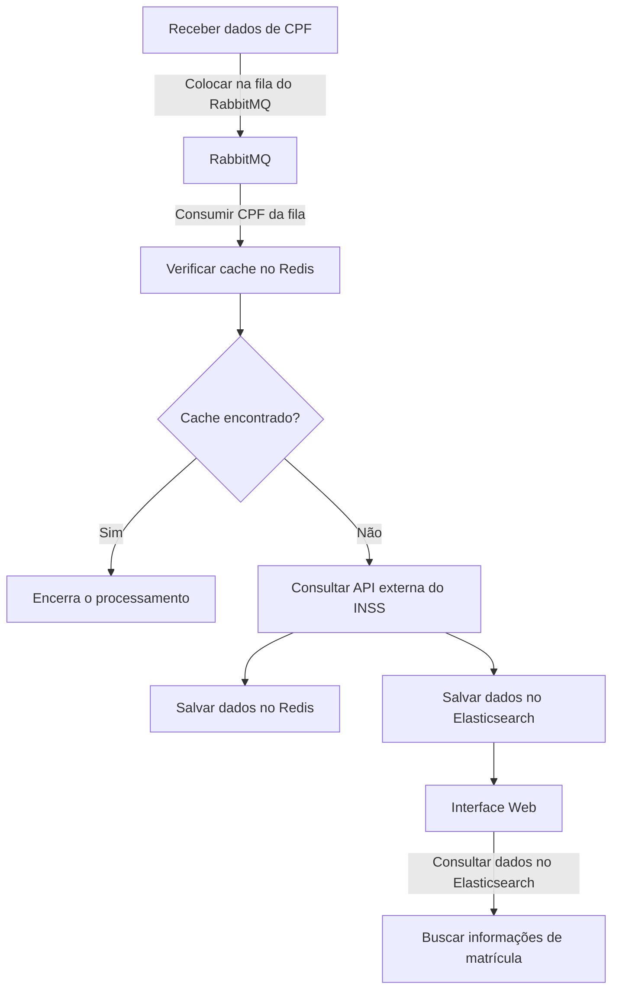
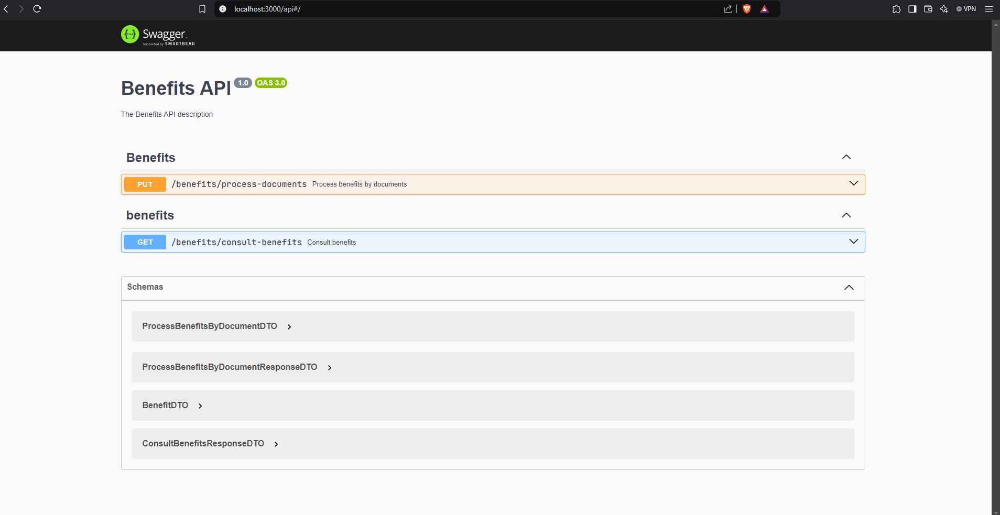
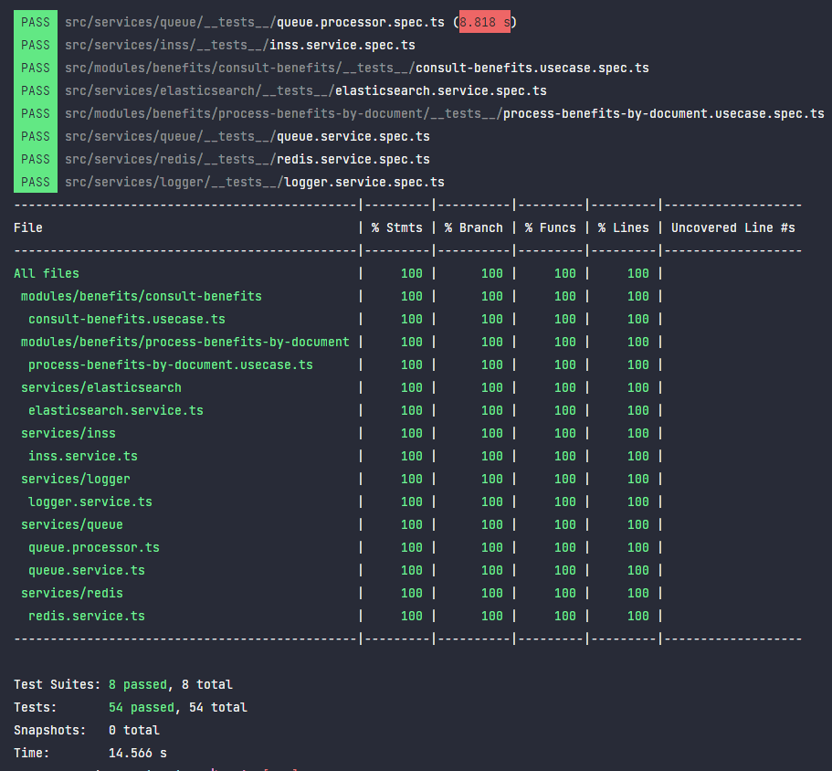

# Desafio Software Engineer - Backend - Node


API para recuperação e processamento de informações de benefícios do INSS.

## Fluxo da Aplicação



### Descrição do Fluxo

1. **Receber dados de CPF**: A API recebe uma lista de CPFs e os coloca em uma fila do RabbitMQ.
2. **Consumir CPF da fila**: O RabbitMQ processa cada CPF individualmente.
3. **Verificar cache no Redis**: Antes de consultar a API externa, a aplicação verifica se os dados do CPF estão no cache do Redis.
   - **Cache encontrado?**:
     - **Sim**: Encerra o processamento para evitar sobrecarregar API externa por 1 hora (TTL do cache).
     - **Não**: Consulta a API externa do INSS.
4. **Consultar API externa do INSS**: Se o CPF não estiver no cache, a aplicação faz uma chamada à API externa.
5. **Salvar dados no Redis**: Os dados retornados pela API são salvos no Redis por 1 hora para evitar reprocessamento.
6. **Salvar dados no Elasticsearch**: Os dados também são indexados no Elasticsearch para futuras consultas.
7. **Interface Web**: A interface web permite buscar dados de matrícula, verificando no Elasticsearch se há informações disponíveis.

## Como rodar

### Pré-requisitos

Instalados na sua máquina:

- Git
- Docker
- Docker Compose

### Quick Start

1. Clone o repositório:

```bash
$ git clone https://github.com/IglanCardeal/konsi-api
$ cd konsi-api
```

2. Crie o arquivo `.env` se baseando no arquivo `.env.example`:

```bash
$ cp .env.example .env
```

3. Defina as credenciais:

```env
INSS_API_USER=
INSS_API_PASSWORD=
```

4. Rode o comando do docker compose para iniciar a aplicação:

```bash
$ docker-compose up -d
```

O processo de build dos containers e a subida do servidor podem levar alguns minutos. Verifique os logs do container `konsi-api` e veja se o servidor subiu corretamente.

Para testar, acesse `http://localhost:3000/api` para entrar na interface do Swagger.

## Interface

O Swagger foi usado para documentar as rotas e incluir uma interface web para testar as rotas:

- `/benefits/process-documents` (PUT) -> Para processar uma lista de CPFs
- `/benefits/consult-benefits` (GET) -> Para consultar um CPF previamente processado

A rota da documentação do swagger pode ser acessada em `http://localhost:3000/api`.



## GitHub Actions - Test Coverage

Este projeto utiliza GitHub Actions para automatizar a execução de testes e a geração de relatórios de cobertura de código. Foram criados testes de unidade para arquivos do tipo `service`, `processor` e `usecase`, onde se encontram as principais regras de fluxo da aplicação e foram atingidos 100% de covertura.



A configuração do workflow está definida para ser executada nas seguintes situações:

- Push na branch `main`
- Pull requests direcionados à branch `main`

### Jobs

- **Run Tests**: Este job é executado em um ambiente Ubuntu e segue os seguintes passos:
  - Checkout do repositório
  - Configuração do Node.js na versão 20, com cache de dependências
  - Cache das dependências do npm
  - Instalação das dependências (somente se o cache não estiver disponível)
  - Execução dos testes com geração de relatórios de cobertura
  - Cache dos resultados de cobertura
  - Upload dos relatórios de cobertura para serem armazenados como artefatos no GitHub

Essa configuração garante que os testes sejam executados automaticamente e que os relatórios de cobertura estejam sempre disponíveis, melhorando a qualidade do código e facilitando a detecção de problemas.

As actions do projeto podem ser consultadas em https://github.com/IglanCardeal/konsi-api/actions.

---

## Descrição do desafio

Olá! Esse desafio técnico tem como propósito medir suas habilidades, ver como estuda, pensa e se organiza na prática. A stack tecnológica utilizada é de sua escolha. Solicitamos que seja utilizado Node com Typescript.

Após finalizar o desafio, nos envie um link para repositório do projeto.

Existem diversas maneiras e profundidades de solucionar o problema que estamos propondo. Vamos listar algumas sub-tasks que podem guiá-lo(a) em relação a essas possibilidades.

## O desafio

A Konsi coleta uma variedade de dados que não são facilmente acessíveis, para propor melhores opções de créditos para seus clientes. Um dos tipos de dados coletados é o número da matrícula e código do tipo do benefício do aposentado ou pensionista.

O desafio é fazer uma API que busque e retorne a matrícula do servidor em uma determinada API externa.

Será necessário desenvolver uma aplicação para coletar esse dado na API externa, uma API para fazer input e buscar o resultado depois.

## A aplicação

É necessário realizar geração de token com as credenciais que vamos fornecer, consultar o CPF do cliente e retornar os dados de benefícios encontrados (número do benefício e código do tipo do benefício).

- Gerar token: POST `/api/v1/token` com o seguinte `body`:
  ```
  {
    "username": string,
    "password": string
  }
  ```
- Buscar dados de benefícios: GET `/api/v1/inss/consulta-beneficios?cpf={cpf}`

Obs: A URL base e credenciais serão enviadas no privado. Caso não tenha recebido, favor solicitar.

### Dado a ser coletado:

* Lista de números das matrículas (número do benefício) com o respectivo código do tipo de benefício.

### Etapas obrigatórias:

* A lista de CPFs deve ser inicialmente colocada em uma fila do **RabbitMQ.**
* Na fila do rabbitmq, devem existir CPFs repetidos.
* Ao consumir da fila do **RabbitMQ** um CPF, o sistema deve verificar previamente no cache do **Redis** se existe um JSON com os dados referentes CPF.
* Após realizar a consulta, os dados de matriculas de um CPF devem ser indexados utilizando **Elasticsearch**.
* Construir uma interface web com um campo de busca. Ao digitar um CPF, o sistema deve verificar no **Elasticsearch** se existem informações de matrícula para o CPF desejado.


## Alguns pontos que serão analisados:

* Organização do código
* Testes
* Facilidade ao rodar o projeto
* Escalabilidade: o quao fácil é escalar a aplicação.
* Performance: aqui avaliaremos o tempo para resgatar e tratar os dados.


*Happy coding! :-)*
